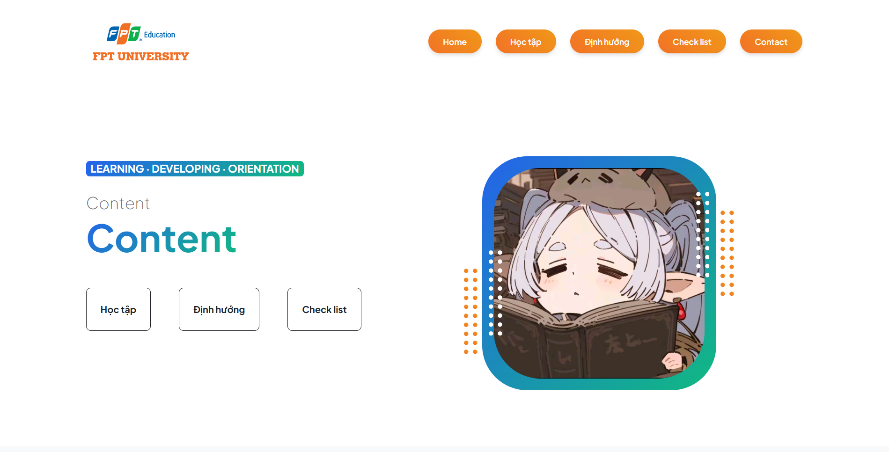

# 🎓 FPTU Roadmap & Personal Portfolio (SSG104 Project)

Chào mừng đến với dự án **FPTU Roadmap**! Đây là website cá nhân được xây dựng để theo dõi lộ trình học tập, lưu trữ tài liệu các môn học tại Đại học FPT và giới thiệu về bản thân.



## ✨ Tính Năng Nổi Bật

* **Responsive Design:** Giao diện tương thích hoàn toàn trên Desktop, Tablet và Mobile nhờ Bootstrap 5.
* **Interactive Timeline:**
    * Hiển thị danh sách môn học theo dạng Timeline dọc (Semester 3...).
    * **Desktop:** Layout 2 cột (Danh sách bên trái - Nội dung chi tiết bên phải).
    * **Mobile:** Tự động xếp chồng hợp lý, tối ưu trải nghiệm người dùng.
* **Dynamic Resource Download:**
    * Nút "Download Material" thông minh.
    * Tự động thay đổi link tải về (từ thư mục `document`) dựa trên môn học đang được chọn.
* **Modern Profile UI:**
    * Ảnh đại diện bo tròn với hiệu ứng Gradient border và các họa tiết trang trí SVG.
    * Tự động căn chỉnh ảnh luôn nằm giữa khung hình.

## 🛠️ Công Nghệ Sử Dụng

* **HTML5** - Cấu trúc trang web.
* **CSS3** - Tùy chỉnh giao diện, Animation, Gradient.
* **Bootstrap 5** - Framework CSS giúp layout và responsive nhanh chóng.
* **JavaScript (Vanilla)** - Xử lý logic nút download động và các tương tác người dùng.

## 📂 Cấu Trúc Thư Mục

Dựa trên cấu trúc dự án `SSG104-PJ`:

```text
SSG104-PJ/
├── assets/
│   ├── favicon.ico             # Icon trang web
│   ├── lazystudy.jpg           # Ảnh profile
│   ├── Logo Đại học FPT.svg    # Logo trường
│   └── screenshot.png          # Ảnh demo dự án
├── css/
│   └── styles.css              # File CSS tùy chỉnh chính
├── document/                   # Thư mục chứa tài liệu môn học
│   ├── DBI202_Materials.zip
│   ├── JPD113_Materials.zip
│   ├── LAB211_Materials.zip
│   ├── MAS291_Materials.zip
│   └── SWE201c_Materials.zip
├── js/
│   └── scripts.js              # Script xử lý logic (Download button, etc.)
├── checklist.html              # Trang Checklist công việc
├── contact.html                # Trang liên hệ
├── index.html                  # Trang chủ (Profile)
├── learn.html                  # Trang học tập (Timeline môn học)
├── orientation.html            # Trang định hướng
└── README.md                   # Tài liệu hướng dẫn
